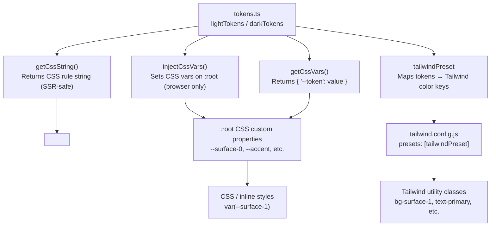

# @kodez/design-tokens

Design token package for Kodez projects. Provides light/dark theme tokens as CSS custom properties, with first-class support for React, Next.js (including App Router SSR), standalone HTML, Tailwind v3, and Tailwind v4.

All semantic and accent color values meet **WCAG AAA (7:1 contrast)** against their intended backgrounds.

## Compatibility

| Environment | Status | Notes |
|---|---|---|
| React + Vite | ✅ Full | ESM — use `injectCssVars` in a `useEffect` |
| React + webpack / CRA | ✅ Full | CJS bundle included |
| Next.js App Router (RSC) | ✅ Full | Use `getCssString` + `<style>` tag in layout |
| Next.js Pages Router | ✅ Full | Use `injectCssVars` in `_app.tsx` effect |
| Next.js ≤12 | ✅ Full | CJS bundle resolves via `require` automatically |
| Standalone HTML | ✅ Full | Link `dist/tokens.css`; no JavaScript needed |
| Tailwind v3 | ✅ Full | Import `tailwindPreset` |
| Tailwind v4 | ✅ Full | Import `dist/tailwind-v4.css` |
| Jest (default config) | ✅ Full | CJS bundle resolves automatically |
| Node.js (ESM or CJS) | ✅ Full | Both module formats shipped |
| SSR / edge runtimes | ✅ Safe | `injectCssVars` is a no-op outside the browser |

---

## Installation

This package is published to the internal Azure Artifacts registry. Add the following to your project's `.npmrc` before installing:

```
@kodez:registry=https://pkgs.dev.azure.com/kodez/kodez-connect/_packaging/kodez-connect-packages/npm/registry/
always-auth=true
```

Then install:

```sh
npm install @kodez/design-tokens
```

Tailwind integration is optional — only install `tailwindcss` if you use it:

```sh
npm install tailwindcss   # only needed for Tailwind preset / v4 CSS
```

---

## How it works



---

## Quick Start

**Option A — JavaScript injection (React, Vue, Vite)**

```ts
import { injectCssVars, lightTokens } from '@kodez/design-tokens';
injectCssVars(lightTokens);  // injects all tokens as :root CSS variables
```

**Option B — Static CSS (no JavaScript required)**

```html
<link rel="stylesheet" href="node_modules/@kodez/design-tokens/dist/tokens.css" />
```

**Option C — SSR / Next.js App Router**

```tsx
import { getCssString, lightTokens, darkTokens } from '@kodez/design-tokens';
const css = getCssString(lightTokens, ':root') + getCssString(darkTokens, '.dark');
return <style dangerouslySetInnerHTML={{ __html: css }} />;
```

---

## React

### Vite / CRA — inject at app root

```tsx
// main.tsx
import { injectCssVars, lightTokens } from '@kodez/design-tokens';
injectCssVars(lightTokens);
```

### Theme switching

```tsx
import { useEffect, useState } from 'react';
import { injectCssVars, lightTokens, darkTokens } from '@kodez/design-tokens';

function useTheme() {
  const [dark, setDark] = useState(false);

  useEffect(() => {
    injectCssVars(dark ? darkTokens : lightTokens);
    document.documentElement.classList.toggle('dark', dark);
  }, [dark]);

  return { dark, setDark };
}
```

---

## Next.js

### App Router (React Server Components)

`injectCssVars` requires `document` and cannot run in Server Components. Use `getCssString` to render tokens as a `<style>` tag — works in any RSC including `app/layout.tsx`:

```tsx
// app/layout.tsx
import { getCssString, lightTokens, darkTokens } from '@kodez/design-tokens';

export default function RootLayout({ children }: { children: React.ReactNode }) {
  const lightCss = getCssString(lightTokens, ':root');
  const darkCss  = getCssString(darkTokens,  '.dark');

  return (
    <html lang="en">
      <head>
        <style dangerouslySetInnerHTML={{ __html: lightCss + darkCss }} />
      </head>
      <body>{children}</body>
    </html>
  );
}
```

Toggle dark mode from a Client Component:

```tsx
'use client';
function DarkModeToggle() {
  return (
    <button onClick={() => document.documentElement.classList.toggle('dark')}>
      Toggle theme
    </button>
  );
}
```

### Pages Router (`_app.tsx`)

```tsx
// pages/_app.tsx
import { useEffect } from 'react';
import { injectCssVars, lightTokens } from '@kodez/design-tokens';
import type { AppProps } from 'next/app';

export default function App({ Component, pageProps }: AppProps) {
  useEffect(() => {
    injectCssVars(lightTokens);
  }, []);

  return <Component {...pageProps} />;
}
```

### next.config.js — no extra config needed

The package ships a CJS bundle (`dist/index.cjs`) resolved via the `require` export condition. No `transpilePackages` or `experimental.esmExternals` required.

---

## Standalone HTML

### Option A — Link the static CSS file

No JavaScript required. Includes light (`:root`), dark (`.dark` class), and OS-preference (`@media (prefers-color-scheme: dark)`) blocks:

```html
<!DOCTYPE html>
<html>
  <head>
    <link rel="stylesheet" href="node_modules/@kodez/design-tokens/dist/tokens.css" />
  </head>
  <body style="background: var(--surface-0); color: var(--text-primary);">
    Hello, design tokens!
  </body>
</html>
```

Toggle dark mode with a class:

```js
document.documentElement.classList.toggle('dark');
```

### Option B — ESM script tag

```html
<script type="module">
  import { injectCssVars, lightTokens } from './node_modules/@kodez/design-tokens/dist/index.js';
  injectCssVars(lightTokens);
</script>
```

---

## Tailwind v3

Add the preset to `tailwind.config.js`:

```js
import { tailwindPreset } from '@kodez/design-tokens';

export default {
  presets: [tailwindPreset],
  content: ['./src/**/*.{ts,tsx,html}'],
  darkMode: 'class',                    // app decides
  corePlugins: { preflight: false },    // false for MUI apps
};
```

Available utility classes:

```
// Surfaces
bg-surface-0  bg-surface-1  bg-surface-2  bg-surface-3  bg-surface-4  bg-surface-5

// Text (generated via theme.extend.textColor — no double prefix)
text-primary  text-secondary  text-muted  text-inverse

// Borders (generated via theme.extend.borderColor — no double prefix)
border-subtle  border-default  border-strong  border-hover  border-interactive

// Accent
bg-accent  bg-accent-hover  bg-accent-dim  bg-accent-border  bg-accent-glow
bg-accent-soft-08  bg-accent-soft-12  bg-accent-soft-14  bg-accent-soft-55
// AAA-compliant accent text colors
text-accent-text-light   (use in light mode — 7.55:1 on white)
text-accent-text-dark    (use in dark mode  — 7.04:1 on surface-1)

// Brand
bg-brand  bg-brand-hover  bg-brand-dim  bg-brand-glow
// AAA-compliant brand text color
text-brand-text-light    (use in light mode — 7.07:1 on white)

// Semantic
bg-danger  bg-danger-bg  bg-danger-border
bg-success  bg-success-bg  bg-success-border  bg-success-soft-12  bg-success-soft-14
bg-warning  bg-warning-bg  bg-warning-soft-16
bg-info  bg-info-bg  bg-info-soft-12  bg-info-soft-14

// Typography
font-sans  font-mono   (Inter / JetBrains Mono)

// Focus
ring-focus
```

---

## Tailwind v4

Import the provided CSS file after `@import "tailwindcss"`:

```css
/* app/globals.css or your CSS entry point */
@import "tailwindcss";
@import "@kodez/design-tokens/dist/tailwind-v4.css";
```

No `tailwind.config.js` needed. The file handles:
- Token injection (`:root` light, `.dark` class, OS dark mode via `@media`)
- `@theme inline` mapping for Tailwind utility generation

Available utilities:

```
bg-surface-0  bg-surface-1  bg-surface-2  bg-surface-3  bg-surface-4  bg-surface-5
bg-accent  bg-accent-hover  bg-accent-dim  bg-accent-border  bg-accent-glow
bg-brand  bg-brand-hover  bg-brand-dim  bg-brand-glow
bg-danger  bg-danger-bg  bg-success  bg-success-bg  bg-warning  bg-info
```

**Text and border colors in v4:** Tailwind v4 generates utility names from `--color-*` variable names, so `--color-text-primary` produces `text-text-primary`. Use arbitrary values for cleaner markup:

```html
<!-- Recommended: arbitrary value -->
<p class="text-[var(--text-primary)]">Body text</p>

<!-- Generated utility (works but verbose) -->
<p class="text-text-primary">Body text</p>
```

---

## API Reference

### `injectCssVars(tokens, element?)`

Injects token values as CSS custom properties. Defaults to `document.documentElement` (`:root`).
**SSR-safe** — silently no-ops when `document` is not defined.

```ts
injectCssVars(lightTokens);
injectCssVars(darkTokens, document.querySelector('#scoped-root')!);
```

### `getCssString(tokens, selector?)`

Returns a CSS rule block string for `<style>` tag injection in SSR contexts.
Default selector is `':root'`.

```ts
const css = getCssString(lightTokens, ':root');
// ':root {\n  --surface-0: #F5F7FA;\n  ...\n}\n'
```

### `getCssVars(tokens)`

Returns a `Record<string, string>` with `--` prefixed keys. Useful for spreading into CSS-in-JS or MUI `sx` props.

```ts
const vars = getCssVars(lightTokens);
// { '--surface-0': '#F5F7FA', '--accent': '#5153F6', ... }
```

### `lightTokens` / `darkTokens`

Plain `Record<string, string>` objects with all token values for each theme.

### `tailwindPreset`

Tailwind v3 preset. Pass to `presets: [tailwindPreset]` in `tailwind.config.js`.

### `ThemeMode`

TypeScript type: `'light' | 'dark'`.

---

## Color Palette

All text-role tokens meet WCAG AAA (≥7:1) contrast. Ratio is against the primary surface for that mode. Color swatches shown for solid hex values; `rgba` tokens are listed as values only.

### Surfaces

| Token | Light | | Dark | |
|---|---|---|---|---|
| `--surface-0` |  | `#F5F7FA` |  | `#09090E` |
| `--surface-1` |  | `#FFFFFF` |  | `#0F0F16` |
| `--surface-2` |  | `#EFF0F2` |  | `#15151E` |
| `--surface-3` |  | `#E7E9EC` |  | `#1C1C27` |
| `--surface-4` |  | `#DFE3E8` |  | `#222230` |
| `--surface-5` |  | `#D4DAE1` |  | `#2B2B3F` |

### Text

| Token | Light | | Contrast | Dark | | Contrast |
|---|---|---|---|---|---|---|
| `--text-primary` |  | `#141515` | 18.3:1 AAA |  | `#EEEEF5` | 16.53:1 AAA |
| `--text-secondary` |  | `#55595F` | 7.05:1 AAA |  | `#ABABC4` | 8.50:1 AAA |
| `--text-muted` |  | `#555961` | 7.03:1 AAA |  | `#9B9BB4` | 7.04:1 AAA |
| `--text-inverse` |  | `#EEEEF5` | — |  | `#141515` | — |

### Borders

| Token | Light | | Dark | |
|---|---|---|---|---|
| `--border-subtle` |  | `#E4E6E9` | — | `rgba(255,255,255,0.05)` |
| `--border-default` |  | `#D8DDE3` | — | `rgba(255,255,255,0.09)` |
| `--border-strong` |  | `#C6CDD6` | — | `rgba(255,255,255,0.20)` |
| `--border-hover` |  | `#B5BCC5` | — | `rgba(255,255,255,0.15)` |
| `--border-interactive` |  | `#5153F6` |  | `#6E70F8` |

### Accent

> `--accent` and `--accent-hover` are for decorative fills, borders, and focus rings — **not for text**. Use `--accent-text-light` or `--accent-text-dark` for any accent-colored text to guarantee AAA contrast.

| Token | Light | | Dark | |
|---|---|---|---|---|
| `--accent` |  | `#5153F6` |  | `#5153F6` |
| `--accent-hover` |  | `#6E70F8` |  | `#6E70F8` |
| `--accent-text-light` ✦ |  | `#3739DC` | — | — |
| `--accent-text-dark` ✦ | — | — |  | `#9092FF` |
| `--accent-dim` | — | `rgba(81,83,246,0.08)` | — | `rgba(81,83,246,0.18)` |
| `--accent-border` | — | `rgba(81,83,246,0.25)` | — | `rgba(81,83,246,0.35)` |
| `--accent-glow` | — | `rgba(81,83,246,0.15)` | — | `rgba(81,83,246,0.35)` |
| `--focus-ring` | — | `rgba(81,83,246,0.20)` | — | `rgba(81,83,246,0.25)` |
| `--accent-soft-08` | — | `rgba(81,83,246,0.08)` | — | `rgba(81,83,246,0.08)` |
| `--accent-soft-12` | — | `rgba(81,83,246,0.12)` | — | `rgba(81,83,246,0.12)` |
| `--accent-soft-14` | — | `rgba(81,83,246,0.14)` | — | `rgba(81,83,246,0.14)` |
| `--accent-soft-55` | — | `rgba(81,83,246,0.55)` | — | `rgba(81,83,246,0.55)` |

✦ AAA text variants: `accent-text-light` = 7.55:1 on white / 7.04:1 on `surface-0`. `accent-text-dark` = 7.04:1 on `surface-1`.

### Brand

> `--brand-primary` is for logos, decorative elements, and illustrations. For brand-colored text on light surfaces use `--brand-text-light` (AAA). In dark mode `--brand-primary` itself is AAA against `surface-1`.

| Token | Light | | Dark | |
|---|---|---|---|---|
| `--brand-primary` |  | `#FF7F56` |  | `#FF7F56` (7.65:1 AAA) |
| `--brand-hover` |  | `#FF9A78` |  | `#FF9A78` |
| `--brand-text-light` ✦ |  | `#A82800` | — | — |
| `--brand-dim` | — | `rgba(255,127,86,0.10)` | — | `rgba(255,127,86,0.18)` |
| `--brand-glow` | — | `rgba(255,127,86,0.15)` | — | `rgba(255,127,86,0.30)` |

✦ AAA text variant: `brand-text-light` = 7.07:1 on white.

### Semantic — Danger

| Token | Light | | Dark | |
|---|---|---|---|---|
| `--color-danger` |  | `#A0130B` (8.10:1 AAA) |  | `#EA7C8C` (7.05:1 AAA) |
| `--color-danger-bg` |  | `#FBECEB` | — | `rgba(234,124,140,0.12)` |
| `--color-danger-border` |  | `#EFC5C2` | — | `rgba(234,124,140,0.25)` |

### Semantic — Success

| Token | Light | | Dark | |
|---|---|---|---|---|
| `--color-success` |  | `#0E5D26` (9.42:1 AAA) |  | `#81C784` (9.49:1 AAA) |
| `--color-success-bg` |  | `#E7F4EC` | — | `rgba(129,199,132,0.12)` |
| `--color-success-border` | — | `rgba(14,93,38,0.25)` | — | `rgba(129,199,132,0.25)` |
| `--success-soft-12` | — | `rgba(14,93,38,0.12)` | — | `rgba(129,199,132,0.12)` |
| `--success-soft-14` | — | `rgba(14,93,38,0.14)` | — | `rgba(129,199,132,0.14)` |

### Semantic — Warning

| Token | Light | | Dark | |
|---|---|---|---|---|
| `--color-warning` |  | `#A92800` (7.02:1 AAA) |  | `#FFB74D` (11.03:1 AAA) |
| `--color-warning-bg` | — | `rgba(169,40,0,0.12)` | — | `rgba(255,183,77,0.16)` |
| `--warning-soft-16` | — | `rgba(169,40,0,0.16)` | — | `rgba(255,183,77,0.16)` |

### Semantic — Info

| Token | Light | | Dark | |
|---|---|---|---|---|
| `--color-info` |  | `#005AA3` (7.02:1 AAA) |  | `#4FC3F7` (9.53:1 AAA) |
| `--color-info-bg` | — | `rgba(0,90,163,0.12)` | — | `rgba(79,195,247,0.12)` |
| `--info-soft-12` | — | `rgba(0,90,163,0.12)` | — | `rgba(79,195,247,0.12)` |
| `--info-soft-14` | — | `rgba(0,90,163,0.14)` | — | `rgba(79,195,247,0.14)` |

### Gradients

| Token | Light | Dark |
|---|---|---|
| `--page-gradient` | Accent + brand radial ellipses (subtle) | Accent + brand radial ellipses (stronger) |
| `--page-gradient-muted` | Dual accent ellipses (very subtle) | Single accent ellipse |
| `--portal-hero-bg` | White gradient + accent ellipse | Accent radial ellipse |

---

## Token Reference

| Category | Tokens |
|---|---|
| Surfaces | `surface-0` … `surface-5` (page → elevated layers) |
| Text | `text-primary`, `text-secondary`, `text-muted`, `text-inverse` |
| Borders | `border-subtle`, `border-default`, `border-strong`, `border-hover`, `border-interactive` |
| Accent | `accent`, `accent-hover`, `accent-text-light`*, `accent-text-dark`*, `accent-dim`, `accent-border`, `accent-glow`, `focus-ring`, `accent-soft-{08/12/14/55}` |
| Brand | `brand-primary`, `brand-hover`, `brand-text-light`*, `brand-dim`, `brand-glow` |
| Semantic | `color-{danger/success/warning/info}` with `-bg` and `-border` variants |
| Gradients | `page-gradient`, `page-gradient-muted`, `portal-hero-bg` |

\* AAA-compliant text variants — use these wherever accent or brand color appears as text.

Example usage:

```css
.card {
  background: var(--surface-1);
  border: 1px solid var(--border-default);
  color: var(--text-primary);
}

.card:focus-visible {
  outline: 2px solid var(--focus-ring);
}

.btn-primary {
  background: var(--accent);
  color: var(--text-inverse);
}

.btn-primary:hover {
  background: var(--accent-hover);
}

/* AAA-compliant accent link in light mode */
.link {
  color: var(--accent-text-light);
}

/* AAA-compliant accent link in dark mode */
.dark .link {
  color: var(--accent-text-dark);
}
```

---

## Font Loading

The Tailwind preset and v4 CSS register Inter and JetBrains Mono but do not load the font files. Add your preferred loading method:

**HTML:**
```html
<link rel="preconnect" href="https://fonts.googleapis.com" />
<link href="https://fonts.googleapis.com/css2?family=Inter:wght@400;500;600&family=JetBrains+Mono&display=swap" rel="stylesheet" />
```

**Next.js (`next/font`):**
```ts
import { Inter, JetBrains_Mono } from 'next/font/google';
export const inter = Inter({ subsets: ['latin'] });
export const mono  = JetBrains_Mono({ subsets: ['latin'] });
```

---

## Development

```sh
npm run build      # tsup (ESM + CJS + .d.ts) then generate dist/tokens.css and dist/tailwind-v4.css
npm run dev        # tsup --watch
npm run typecheck  # tsc --noEmit
```

Build outputs:

| File | Purpose |
|---|---|
| `dist/index.js` | ESM bundle |
| `dist/index.cjs` | CommonJS bundle |
| `dist/index.d.ts` | TypeScript declarations (ESM) |
| `dist/index.d.cts` | TypeScript declarations (CJS) |
| `dist/tokens.css` | Standalone CSS for HTML projects |
| `dist/tailwind-v4.css` | Tailwind v4 integration CSS |

---

## Migration from v1.4.x to v1.5.0

### AAA text tokens added

Three new tokens provide AAA-compliant foreground colors for accent and brand text:

| New token | | Use case | Contrast |
|---|---|---|---|
| `--accent-text-light` |  | Accent-colored links/text on light surfaces | 7.55:1 on white, 7.04:1 on `surface-0` |
| `--accent-text-dark` |  | Accent-colored links/text on dark surfaces | 7.04:1 on `surface-1` |
| `--brand-text-light` |  | Brand-colored text on light surfaces | 7.07:1 on white |

Replace any direct use of `--accent` or `--brand-primary` as a text color with the appropriate variant.

### Tokens removed

The following token groups were removed. Migrate to the recommended alternatives:

| Removed token | Alternative |
|---|---|
| `--modal-backdrop`, `--overlay-*`, `--modal-shadow` | Use a hardcoded `rgba(9,9,14,0.72)` scrim or your own CSS variable |
| `--color-genai`, `--color-genai-bg` | Define locally in your app's stylesheet |
| `--status-error`, `--status-success`, `--status-warning` (and variants) | Use `--color-danger`, `--color-success`, `--color-warning` |
| `--shadow-card`, `--shadow-4` | Define locally with `box-shadow` |
| `--accent-soft-04/06/10/16/18/20/25/30` | Use the kept variants: `08`, `12`, `14`, `55` |

### Semantic color values updated

All semantic foreground colors were adjusted to reach AAA contrast. If you were referencing the raw hex values directly in tests or design tools, update to the new values shown in the [Color Palette](#color-palette) section above.

---

## Migration from v1.1.x

### Tailwind preset — utility class names fixed

Text and border tokens were previously placed in `theme.extend.colors`, which generated class names with double prefixes. This is fixed in v1.2.0:

| v1.1.x (broken) | v1.2.0+ (correct) |
|---|---|
| `text-text-primary` | `text-primary` |
| `text-text-secondary` | `text-secondary` |
| `text-text-muted` | `text-muted` |
| `text-text-inverse` | `text-inverse` |
| `border-border-subtle` | `border-subtle` |
| `border-border-default` | `border-default` |
| `border-border-strong` | `border-strong` |
| `border-border-hover` | `border-hover` |
| `border-border-interactive` | `border-interactive` |

### New exports

`getCssString` is new in v1.2.0 — no migration needed for existing code.

### Module format

v1.1.x was ESM-only. v1.2.0 ships both ESM (`dist/index.js`) and CJS (`dist/index.cjs`). Existing ESM imports continue to work without changes.
