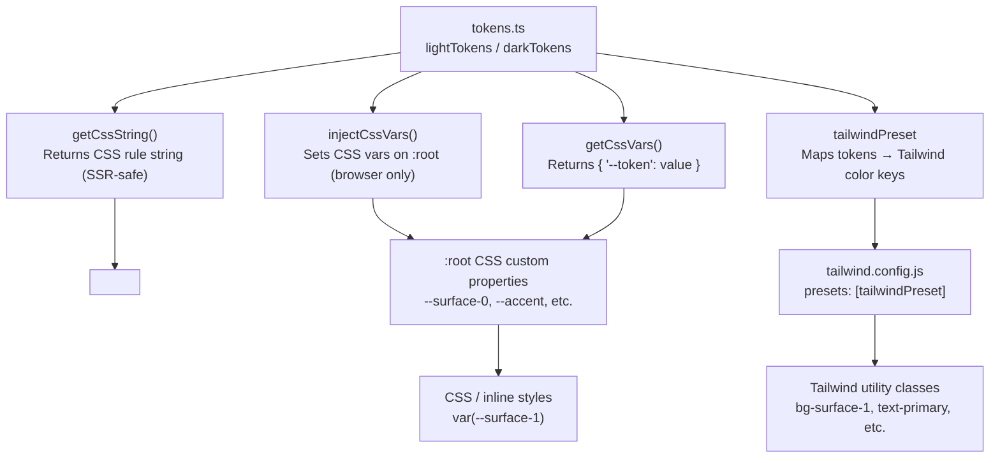

# @kodez/design-tokens

Design token package for Kodez projects. Provides light/dark theme tokens as CSS custom properties, with first-class support for React, Next.js (including App Router SSR), standalone HTML, Tailwind v3, and Tailwind v4.

## Compatibility

| Environment | Status | Notes |
|---|---|---|
| React + Vite | ✅ Full | ESM — use `injectCssVars` in a `useEffect` |
| React + webpack / CRA | ✅ Full | CJS bundle included |
| Next.js App Router (RSC) | ✅ Full | Use `getCssString` + `<style>` tag in layout |
| Next.js Pages Router | ✅ Full | Use `injectCssVars` in `_app.tsx` effect |
| Next.js ≤12 | ✅ Full | CJS bundle resolves via `require` automatically |
| Standalone HTML | ✅ Full | Link `dist/tokens.css`; no JavaScript needed |
| Tailwind v3 | ✅ Full | Import `tailwindPreset` |
| Tailwind v4 | ✅ Full | Import `dist/tailwind-v4.css` |
| Jest (default config) | ✅ Full | CJS bundle resolves automatically |
| Node.js (ESM or CJS) | ✅ Full | Both module formats shipped |
| SSR / edge runtimes | ✅ Safe | `injectCssVars` is a no-op outside the browser |

---

## Installation

This package is published to the internal Azure Artifacts registry. Add the following to your project's `.npmrc` before installing:

```
@kodez:registry=https://pkgs.dev.azure.com/kodez/kodez-connect/_packaging/kodez-connect-packages/npm/registry/
always-auth=true
```

Then install:

```sh
npm install @kodez/design-tokens
```

Tailwind integration is optional — only install `tailwindcss` if you use it:

```sh
npm install tailwindcss   # only needed for Tailwind preset / v4 CSS
```

---

## How it works



---

## Quick Start

**Option A — JavaScript injection (React, Vue, Vite)**

```ts
import { injectCssVars, lightTokens } from '@kodez/design-tokens';
injectCssVars(lightTokens);  // injects all tokens as :root CSS variables
```

**Option B — Static CSS (no JavaScript required)**

```html
<link rel="stylesheet" href="node_modules/@kodez/design-tokens/dist/tokens.css" />
```

**Option C — SSR / Next.js App Router**

```tsx
import { getCssString, lightTokens, darkTokens } from '@kodez/design-tokens';
const css = getCssString(lightTokens, ':root') + getCssString(darkTokens, '.dark');
return <style dangerouslySetInnerHTML={{ __html: css }} />;
```

---

## React

### Vite / CRA — inject at app root

```tsx
// main.tsx
import { injectCssVars, lightTokens } from '@kodez/design-tokens';
injectCssVars(lightTokens);
```

### Theme switching

```tsx
import { useEffect, useState } from 'react';
import { injectCssVars, lightTokens, darkTokens } from '@kodez/design-tokens';

function useTheme() {
  const [dark, setDark] = useState(false);

  useEffect(() => {
    injectCssVars(dark ? darkTokens : lightTokens);
    document.documentElement.classList.toggle('dark', dark);
  }, [dark]);

  return { dark, setDark };
}
```

---

## Next.js

### App Router (React Server Components)

`injectCssVars` requires `document` and cannot run in Server Components. Use `getCssString` to render tokens as a `<style>` tag — works in any RSC including `app/layout.tsx`:

```tsx
// app/layout.tsx
import { getCssString, lightTokens, darkTokens } from '@kodez/design-tokens';

export default function RootLayout({ children }: { children: React.ReactNode }) {
  const lightCss = getCssString(lightTokens, ':root');
  const darkCss  = getCssString(darkTokens,  '.dark');

  return (
    <html lang="en">
      <head>
        <style dangerouslySetInnerHTML={{ __html: lightCss + darkCss }} />
      </head>
      <body>{children}</body>
    </html>
  );
}
```

Toggle dark mode from a Client Component:

```tsx
'use client';
function DarkModeToggle() {
  return (
    <button onClick={() => document.documentElement.classList.toggle('dark')}>
      Toggle theme
    </button>
  );
}
```

### Pages Router (`_app.tsx`)

```tsx
// pages/_app.tsx
import { useEffect } from 'react';
import { injectCssVars, lightTokens } from '@kodez/design-tokens';
import type { AppProps } from 'next/app';

export default function App({ Component, pageProps }: AppProps) {
  useEffect(() => {
    injectCssVars(lightTokens);
  }, []);

  return <Component {...pageProps} />;
}
```

### next.config.js — no extra config needed

The package ships a CJS bundle (`dist/index.cjs`) resolved via the `require` export condition. No `transpilePackages` or `experimental.esmExternals` required.

---

## Standalone HTML

### Option A — Link the static CSS file

No JavaScript required. Includes light (`:root`), dark (`.dark` class), and OS-preference (`@media (prefers-color-scheme: dark)`) blocks:

```html
<!DOCTYPE html>
<html>
  <head>
    <link rel="stylesheet" href="node_modules/@kodez/design-tokens/dist/tokens.css" />
  </head>
  <body style="background: var(--surface-0); color: var(--text-primary);">
    Hello, design tokens!
  </body>
</html>
```

Toggle dark mode with a class:

```js
document.documentElement.classList.toggle('dark');
```

### Option B — ESM script tag

```html
<script type="module">
  import { injectCssVars, lightTokens } from './node_modules/@kodez/design-tokens/dist/index.js';
  injectCssVars(lightTokens);
</script>
```

---

## Tailwind v3

Add the preset to `tailwind.config.js`:

```js
import { tailwindPreset } from '@kodez/design-tokens';

export default {
  presets: [tailwindPreset],
  content: ['./src/**/*.{ts,tsx,html}'],
  darkMode: 'class',                    // app decides
  corePlugins: { preflight: false },    // false for MUI apps
};
```

Available utility classes:

```
// Surfaces
bg-surface-0  bg-surface-1  bg-surface-2  bg-surface-3  bg-surface-4  bg-surface-5

// Text (generated via theme.extend.textColor — no double prefix)
text-primary  text-secondary  text-muted  text-inverse

// Borders (generated via theme.extend.borderColor — no double prefix)
border-subtle  border-default  border-strong  border-hover  border-interactive

// Accent
bg-accent  bg-accent-hover  bg-accent-dim  bg-accent-border  bg-accent-glow
bg-accent-soft-08  bg-accent-soft-12  bg-accent-soft-14  bg-accent-soft-55

// Brand
bg-brand  bg-brand-hover  bg-brand-dim  bg-brand-glow

// Semantic
bg-danger  bg-danger-bg  bg-danger-border
bg-success  bg-success-bg  bg-success-border  bg-success-soft-12  bg-success-soft-14
bg-warning  bg-warning-bg  bg-warning-soft-16
bg-info  bg-info-bg  bg-info-soft-12  bg-info-soft-14

// Typography
font-sans  font-mono   (Inter / JetBrains Mono)

// Focus
ring-focus
```

---

## Tailwind v4

Import the provided CSS file after `@import "tailwindcss"`:

```css
/* app/globals.css or your CSS entry point */
@import "tailwindcss";
@import "@kodez/design-tokens/dist/tailwind-v4.css";
```

No `tailwind.config.js` needed. The file handles:
- Token injection (`:root` light, `.dark` class, OS dark mode via `@media`)
- `@theme inline` mapping for Tailwind utility generation

Available utilities:

```
bg-surface-0  bg-surface-1  bg-surface-2  bg-surface-3  bg-surface-4  bg-surface-5
bg-accent  bg-accent-hover  bg-accent-dim  bg-accent-border  bg-accent-glow
bg-brand  bg-brand-hover  bg-brand-dim  bg-brand-glow
bg-danger  bg-danger-bg  bg-success  bg-success-bg  bg-warning  bg-info
```

**Text and border colors in v4:** Tailwind v4 generates utility names from `--color-*` variable names, so `--color-text-primary` produces `text-text-primary`. Use arbitrary values for cleaner markup:

```html
<!-- Recommended: arbitrary value -->
<p class="text-[var(--text-primary)]">Body text</p>

<!-- Generated utility (works but verbose) -->
<p class="text-text-primary">Body text</p>
```

---

## API Reference

### `injectCssVars(tokens, element?)`

Injects token values as CSS custom properties. Defaults to `document.documentElement` (`:root`).
**SSR-safe** — silently no-ops when `document` is not defined.

```ts
injectCssVars(lightTokens);
injectCssVars(darkTokens, document.querySelector('#scoped-root')!);
```

### `getCssString(tokens, selector?)`

Returns a CSS rule block string for `<style>` tag injection in SSR contexts.
Default selector is `':root'`.

```ts
const css = getCssString(lightTokens, ':root');
// ':root {\n  --surface-0: #F5F7FA;\n  ...\n}\n'
```

### `getCssVars(tokens)`

Returns a `Record<string, string>` with `--` prefixed keys. Useful for spreading into CSS-in-JS or MUI `sx` props.

```ts
const vars = getCssVars(lightTokens);
// { '--surface-0': '#F5F7FA', '--accent': '#5153F6', ... }
```

### `lightTokens` / `darkTokens`

Plain `Record<string, string>` objects with all token values for each theme.

### `tailwindPreset`

Tailwind v3 preset. Pass to `presets: [tailwindPreset]` in `tailwind.config.js`.

### `ThemeMode`

TypeScript type: `'light' | 'dark'`.

---

## Token Reference

All tokens available as `var(--token-name)` after injection:

| Category | Tokens |
|---|---|
| Surfaces | `surface-0` … `surface-5` (page → elevated layers) |
| Text | `text-primary`, `text-secondary`, `text-muted`, `text-inverse` |
| Borders | `border-subtle`, `border-default`, `border-strong`, `border-hover`, `border-interactive` |
| Accent | `accent`, `accent-hover`, `accent-dim`, `accent-border`, `accent-glow`, `focus-ring`, `accent-soft-{08/12/14/55}` |
| Brand | `brand-primary`, `brand-hover`, `brand-dim`, `brand-glow` |
| Semantic | `color-{danger/success/warning/info}` with `-bg` and `-border` variants |
| Gradients | `page-gradient`, `page-gradient-muted`, `portal-hero-bg` |

Example usage:

```css
.card {
  background: var(--surface-1);
  border: 1px solid var(--border-default);
  color: var(--text-primary);
}

.card:focus-visible {
  outline: 2px solid var(--focus-ring);
}

.btn-primary {
  background: var(--accent);
  color: var(--text-inverse);
}

.btn-primary:hover {
  background: var(--accent-hover);
}
```

---

## Font Loading

The Tailwind preset and v4 CSS register Inter and JetBrains Mono but do not load the font files. Add your preferred loading method:

**HTML:**
```html
<link rel="preconnect" href="https://fonts.googleapis.com" />
<link href="https://fonts.googleapis.com/css2?family=Inter:wght@400;500;600&family=JetBrains+Mono&display=swap" rel="stylesheet" />
```

**Next.js (`next/font`):**
```ts
import { Inter, JetBrains_Mono } from 'next/font/google';
export const inter = Inter({ subsets: ['latin'] });
export const mono  = JetBrains_Mono({ subsets: ['latin'] });
```

---

## Development

```sh
npm run build      # tsup (ESM + CJS + .d.ts) then generate dist/tokens.css and dist/tailwind-v4.css
npm run dev        # tsup --watch
npm run typecheck  # tsc --noEmit
```

Build outputs:

| File | Purpose |
|---|---|
| `dist/index.js` | ESM bundle |
| `dist/index.cjs` | CommonJS bundle |
| `dist/index.d.ts` | TypeScript declarations (ESM) |
| `dist/index.d.cts` | TypeScript declarations (CJS) |
| `dist/tokens.css` | Standalone CSS for HTML projects |
| `dist/tailwind-v4.css` | Tailwind v4 integration CSS |

---

## Migration from v1.1.x

### Tailwind preset — utility class names fixed

Text and border tokens were previously placed in `theme.extend.colors`, which generated class names with double prefixes. This is fixed in v1.2.0:

| v1.1.x (broken) | v1.2.0 (correct) |
|---|---|
| `text-text-primary` | `text-primary` |
| `text-text-secondary` | `text-secondary` |
| `text-text-muted` | `text-muted` |
| `text-text-inverse` | `text-inverse` |
| `border-border-subtle` | `border-subtle` |
| `border-border-default` | `border-default` |
| `border-border-strong` | `border-strong` |
| `border-border-hover` | `border-hover` |
| `border-border-interactive` | `border-interactive` |

### New exports

`getCssString` is new in v1.2.0 — no migration needed for existing code.

### Module format

v1.1.x was ESM-only. v1.2.0 ships both ESM (`dist/index.js`) and CJS (`dist/index.cjs`). Existing ESM imports continue to work without changes.
