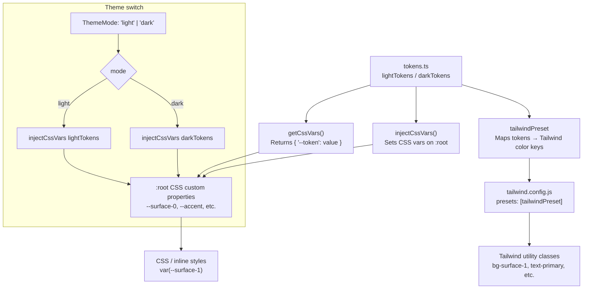

# @kodez/design-tokens

Shared design token library for Kodez projects. Provides typed color tokens for light and dark themes, CSS variable injection helpers, and a Tailwind v3 preset — all from a single ESM package.

## How it works



## Installation

The package is published to the internal Kodez Azure Artifacts registry. Make sure your project has an `.npmrc` pointing to it, then:

```sh
npm install @kodez/design-tokens
```

## Usage

### Option 1 — CSS variables (framework-agnostic)

Inject tokens once at app startup. All tokens become CSS custom properties on `:root`.

```ts
import { injectCssVars, lightTokens, darkTokens } from '@kodez/design-tokens';

// Default to light theme
injectCssVars(lightTokens);

// Switch themes at runtime
function applyTheme(mode: 'light' | 'dark') {
  injectCssVars(mode === 'dark' ? darkTokens : lightTokens);
}
```

Use the variables anywhere in CSS:

```css
.card {
  background: var(--surface-1);
  border: 1px solid var(--border-default);
  color: var(--text-primary);
}

.btn-primary {
  background: var(--accent);
  color: var(--text-inverse);
}
```

If you need the token map as a plain object (e.g. for MUI `CssBaseline` or CSS-in-JS):

```ts
import { getCssVars, darkTokens } from '@kodez/design-tokens';

const cssVars = getCssVars(darkTokens);
// { '--surface-0': '#09090E', '--accent': '#5153F6', ... }
```

### Option 2 — Tailwind preset

Add the preset to your Tailwind config. The app controls `darkMode` and `preflight`.

```js
// tailwind.config.js
import { tailwindPreset } from '@kodez/design-tokens';

export default {
  presets: [tailwindPreset],
  content: ['./src/**/*.{ts,tsx}'],
  darkMode: 'class',                    // you decide
  corePlugins: { preflight: false },    // set false for MUI apps
};
```

Then use token-backed utility classes directly:

```tsx
<div className="bg-surface-1 border border-default text-primary">
  <button className="bg-accent text-inverse hover:bg-accent-hover">
    Save
  </button>
</div>
```

## Token categories

| Category  | Tokens                                                                 |
|-----------|------------------------------------------------------------------------|
| Surfaces  | `surface-0` … `surface-5` (page → elevated layers)                    |
| Text      | `text-primary`, `text-secondary`, `text-muted`, `text-inverse`        |
| Borders   | `border-subtle`, `border-default`, `border-strong`, `border-hover`, `border-interactive` |
| Accent    | `accent`, `accent-hover`, `accent-dim`, `accent-border`, `focus-ring` |
| Brand     | `brand-primary`, `brand-hover`, `brand-dim`, `brand-glow`             |
| Semantic  | `color-danger/success/warning/info` with `-bg` and `-border` variants  |
| Gradients | `page-gradient`, `page-gradient-muted`, `portal-hero-bg`              |

All tokens exist in both `lightTokens` and `darkTokens`. The dark variants are applied automatically when you call `injectCssVars(darkTokens)` — no separate dark-mode CSS overrides needed.

## TypeScript

```ts
import { lightTokens, darkTokens, ThemeMode } from '@kodez/design-tokens';

function getTokens(mode: ThemeMode) {
  return mode === 'dark' ? darkTokens : lightTokens;
}
```

`ThemeMode` is `'light' | 'dark'`. All token maps are typed as `Record<string, string>`.

## Development

```sh
npm run build   # compile TypeScript → dist/
npm run dev     # watch mode
```

The package is ESM-only. It is compiled to `dist/` and published via the `build` script.
