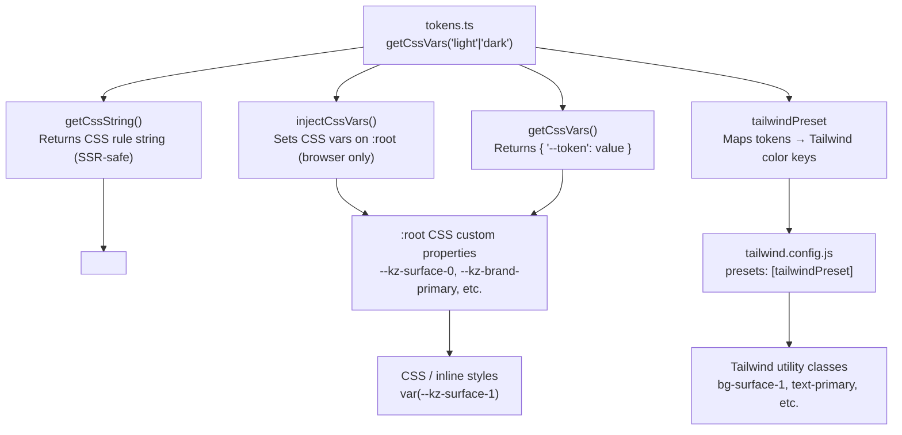

# @kodez/design-tokens

Design token package for Kodez projects. Provides light/dark theme tokens as CSS custom properties, with first-class support for React, Next.js (including App Router SSR), standalone HTML, Tailwind v3, and Tailwind v4.

All semantic and accent color values meet **WCAG AAA (7:1 contrast)** against their intended backgrounds.

## Compatibility

| Environment | Status | Notes |
|---|---|---|
| React + Vite | ✅ Full | ESM — use `injectCssVars` in a `useEffect` |
| React + webpack / CRA | ✅ Full | CJS bundle included |
| Next.js App Router (RSC) | ✅ Full | Use `getCssString` + `<style>` tag in layout |
| Next.js Pages Router | ✅ Full | Use `injectCssVars` in `_app.tsx` effect |
| Next.js ≤12 | ✅ Full | CJS bundle resolves via `require` automatically |
| Standalone HTML | ✅ Full | Link `dist/tokens.css`; no JavaScript needed |
| Tailwind v3 | ✅ Full | Import `tailwindPreset` |
| Tailwind v4 | ✅ Full | Import `dist/tailwind-v4.css` |
| Jest (default config) | ✅ Full | CJS bundle resolves automatically |
| Node.js (ESM or CJS) | ✅ Full | Both module formats shipped |
| SSR / edge runtimes | ✅ Safe | `injectCssVars` is a no-op outside the browser |

---

## Installation

This package is published to the internal Azure Artifacts registry. Add the following to your project's `.npmrc` before installing:

```
@kodez:registry=https://pkgs.dev.azure.com/kodez/kodez-connect/_packaging/kodez-connect-packages/npm/registry/
always-auth=true
```

Then install:

```sh
npm install @kodez/design-tokens
```

Tailwind integration is optional — only install `tailwindcss` if you use it:

```sh
npm install tailwindcss   # only needed for Tailwind preset / v4 CSS
```

---

## How it works

> All CSS custom properties use the `--kz-` namespace prefix (e.g. `--kz-surface-0`, `--kz-brand-primary`). This prevents collisions with other CSS variable libraries in your project.



---

## Quick Start

**Option A — JavaScript injection (React, Vue, Vite)**

```ts
import { injectCssVars } from '@kodez/design-tokens';
injectCssVars('light');  // injects all tokens as :root CSS variables
```

**Option B — Static CSS (no JavaScript required)**

```html
<link rel="stylesheet" href="node_modules/@kodez/design-tokens/dist/tokens.css" />
```

**Option C — SSR / Next.js App Router**

```tsx
import { getCssString } from '@kodez/design-tokens';
const css = getCssString('light', ':root') + getCssString('dark', '.dark');
return <style dangerouslySetInnerHTML={{ __html: css }} />;
```

---

## React

### Vite / CRA — inject at app root

```tsx
// main.tsx
import { injectCssVars } from '@kodez/design-tokens';
injectCssVars('light');
```

### Theme switching

```tsx
import { useEffect, useState } from 'react';
import { injectCssVars } from '@kodez/design-tokens';

function useTheme() {
  const [dark, setDark] = useState(false);

  useEffect(() => {
    injectCssVars(dark ? 'dark' : 'light');
    document.documentElement.classList.toggle('dark', dark);
  }, [dark]);

  return { dark, setDark };
}
```

---

## Next.js

### App Router (React Server Components)

`injectCssVars` requires `document` and cannot run in Server Components. Use `getCssString` to render tokens as a `<style>` tag — works in any RSC including `app/layout.tsx`:

```tsx
// app/layout.tsx
import { getCssString } from '@kodez/design-tokens';

export default function RootLayout({ children }: { children: React.ReactNode }) {
  const lightCss = getCssString('light', ':root');
  const darkCss  = getCssString('dark',  '.dark');

  return (
    <html lang="en">
      <head>
        <style dangerouslySetInnerHTML={{ __html: lightCss + darkCss }} />
      </head>
      <body>{children}</body>
    </html>
  );
}
```

Toggle dark mode from a Client Component:

```tsx
'use client';
function DarkModeToggle() {
  return (
    <button onClick={() => document.documentElement.classList.toggle('dark')}>
      Toggle theme
    </button>
  );
}
```

### Pages Router (`_app.tsx`)

```tsx
// pages/_app.tsx
import { useEffect } from 'react';
import { injectCssVars } from '@kodez/design-tokens';
import type { AppProps } from 'next/app';

export default function App({ Component, pageProps }: AppProps) {
  useEffect(() => {
    injectCssVars('light');
  }, []);

  return <Component {...pageProps} />;
}
```

### next.config.js — no extra config needed

The package ships a CJS bundle (`dist/index.cjs`) resolved via the `require` export condition. No `transpilePackages` or `experimental.esmExternals` required.

---

## Standalone HTML

### Option A — Link the static CSS file

No JavaScript required. Includes light (`:root`), dark (`.dark` class), and OS-preference (`@media (prefers-color-scheme: dark)`) blocks:

```html
<!DOCTYPE html>
<html>
  <head>
    <link rel="stylesheet" href="node_modules/@kodez/design-tokens/dist/tokens.css" />
  </head>
  <body style="background: var(--kz-surface-0); color: var(--kz-text-primary);">
    Hello, design tokens!
  </body>
</html>
```

Toggle dark mode with a class:

```js
document.documentElement.classList.toggle('dark');
```

### Option B — ESM script tag

```html
<script type="module">
  import { injectCssVars } from './node_modules/@kodez/design-tokens/dist/index.js';
  injectCssVars('light');
</script>
```

---

## Tailwind v3

Add the preset to `tailwind.config.js`:

```js
import { tailwindPreset } from '@kodez/design-tokens';

export default {
  presets: [tailwindPreset],
  content: ['./src/**/*.{ts,tsx,html}'],
  darkMode: 'class',                    // app decides
  corePlugins: { preflight: false },    // false for MUI apps
};
```

Available utility classes:

```
// Surfaces
bg-surface-0  bg-surface-1  bg-surface-2  bg-surface-3  bg-surface-4  bg-surface-5

// Section backgrounds
bg-section-bg-page  bg-section-bg-base  bg-section-bg-raised  bg-section-bg-overlay  bg-section-bg-glow

// Text (generated via theme.extend.textColor — no double prefix)
text-primary  text-secondary  text-tertiary  text-disabled  text-inverse
text-brand    (brand-colored text — mode-adaptive)
text-error    text-success    text-warning

// Strokes (generated via theme.extend.borderColor — no double prefix)
border-subtle  border-default  border-strong  border-hover  border-interactive

// Brand
bg-brand-primary  bg-brand-hover  bg-brand-active
bg-brand-border  bg-brand-border-subtle
bg-brand-gradient-1  bg-brand-gradient-2

// Overlay
bg-overlay-backdrop

// Semantic — backgrounds and borders
bg-error-bg-solid    bg-error-bg-subtle    bg-error-border    bg-error-border-subtle
bg-success-bg-solid  bg-success-bg-subtle  bg-success-border  bg-success-border-subtle
bg-warning-bg-solid  bg-warning-bg-subtle  bg-warning-border  bg-warning-border-subtle

// Typography
font-sans  font-mono   (Inter / JetBrains Mono)
```

---

## Tailwind v4

Import the provided CSS file after `@import "tailwindcss"`:

```css
/* app/globals.css or your CSS entry point */
@import "tailwindcss";
@import "@kodez/design-tokens/dist/tailwind-v4.css";
```

No `tailwind.config.js` needed. The file handles:
- Token injection (`:root` light, `.dark` class, OS dark mode via `@media`)
- `@theme inline` mapping for Tailwind utility generation

Available utilities:

```
bg-surface-0  bg-surface-1  bg-surface-2  bg-surface-3  bg-surface-4  bg-surface-5
bg-section-bg-page  bg-section-bg-base  bg-section-bg-raised  bg-section-bg-overlay
bg-brand-primary  bg-brand-hover  bg-brand-active
bg-error-bg-solid  bg-error-bg-subtle  bg-success-bg-solid  bg-success-bg-subtle
bg-warning-bg-solid  bg-warning-bg-subtle
```

**Text and border colors in v4:** Tailwind v4 generates utility names from `--color-*` variable names, so `--color-text-primary` produces `text-text-primary`. Use arbitrary values for cleaner markup:

```html
<!-- Recommended: arbitrary value -->
<p class="text-[var(--kz-text-primary)]">Body text</p>

<!-- Generated utility (works but verbose) -->
<p class="text-text-primary">Body text</p>
```

---

## API Reference

### `injectCssVars(mode: ThemeMode, element?)`

Injects token values as CSS custom properties. Defaults to `document.documentElement` (`:root`).
**SSR-safe** — silently no-ops when `document` is not defined.

```ts
injectCssVars('light');
injectCssVars('dark', document.querySelector('#scoped-root')!);
```

### `getCssString(mode: ThemeMode, selector?)`

Returns a CSS rule block string for `<style>` tag injection in SSR contexts.
Default selector is `':root'`.

```ts
const css = getCssString('light', ':root');
// ':root {\n  --kz-surface-0: #FFFFFF;\n  ...\n}\n'
```

### `getCssVars(mode: ThemeMode)`

Returns a `Record<KzCssVar, string>` with `--kz-*` prefixed keys. Useful for spreading into CSS-in-JS or MUI `sx` props.

```ts
const vars = getCssVars('light');
// { '--kz-surface-0': '#FFFFFF', '--kz-brand-primary': '#FF7F56', ... }
```

### `tailwindPreset`

Tailwind v3 preset. Pass to `presets: [tailwindPreset]` in `tailwind.config.js`.

### `ThemeMode`

TypeScript type: `'light' | 'dark'`.

---

## Color Palette

Color swatches shown for solid hex values; `rgba` tokens are listed as values only.

### Surfaces

<!-- kz:autogen:start:surfaces -->
| Token | Light | | Dark | |
|---|---|---|---|---|
| `--surface-0` |  | `#FFFFFF` |  | `#08080E` |
| `--surface-1` |  | `#F9F8F7` |  | `#0D0D1A` |
| `--surface-2` |  | `#F5F4F2` |  | `#121224` |
| `--surface-3` |  | `#EDEBE8` |  | `#17172E` |
| `--surface-4` |  | `#E4E1DE` |  | `#1C1C38` |
| `--surface-5` |  | `#DAD7D3` |  | `#212142` |
<!-- kz:autogen:end:surfaces -->

### Section Backgrounds

<!-- kz:autogen:start:section-bg -->
| Token | Light | | Dark | |
|---|---|---|---|---|
| `--section-bg-page` | `#FFFFFF` | | `#08080E` | |
| `--section-bg-base` | `#F9F8F7` | | `#0D0D1A` | |
| `--section-bg-raised` | `#F5F4F2` | | `#121224` | |
| `--section-bg-overlay` | `#EDEBE8` | | `#17172E` | |
| `--section-bg-glow` | — | `rgba(81,83,246,0.04)` | — | `rgba(81,83,246,0.12)` |
<!-- kz:autogen:end:section-bg -->

### Text

<!-- kz:autogen:start:text -->
| Token | Light | | Dark | |
|---|---|---|---|---|
| `--text-primary` |  | `#231F20` |  | `#F5F4F2` |
| `--text-secondary` |  | `#4A4546` |  | `#999999` |
| `--text-tertiary` |  | `#6F6B6C` |  | `#8C90A0` |
| `--text-disabled` |  | `#A6A2A3` |  | `#5A5556` |
| `--text-inverse` |  | `#FFFFFF` |  | `#231F20` |
<!-- kz:autogen:end:text -->

### Strokes

<!-- kz:autogen:start:strokes -->
| Token | Light | | Dark | |
|---|---|---|---|---|
| `--stroke-subtle` |  | `#EDEBE8` |  | `#1A1A34` |
| `--stroke-default` |  | `#D5D2CE` |  | `#262648` |
| `--stroke-strong` |  | `#B9B5B2` |  | `#323260` |
| `--stroke-hover` |  | `#9E9A97` |  | `#44447E` |
| `--stroke-interactive` |  | `#FF7F56` |  | `#FF7F56` |
<!-- kz:autogen:end:strokes -->

### Brand

<!-- kz:autogen:start:brand -->
| Token | Light | | Dark | |
|---|---|---|---|---|
| `--brand-primary` |  | `#FF7F56` |  | `#FF7F56` |
| `--brand-hover` |  | `#CB6241` |  | `#F89474` |
| `--brand-active` |  | `#743622` |  | `#FAAF97` |
| `--brand-border` |  | `#743622` |  | `#FF7F56` |
| `--brand-border-subtle` | — | `rgba(255,127,86,0.40)` | — | `rgba(255,127,86,0.40)` |
| `--brand-text` |  | `#A04C31` |  | `#FF7F56` |
| `--brand-gradient-1` |  | `#F89474` |  | `#F89474` |
| `--brand-gradient-2` |  | `#F0673D` |  | `#F0673D` |
<!-- kz:autogen:end:brand -->

### Semantic — Error

<!-- kz:autogen:start:semantic-error -->
| Token | Light | | Dark | |
|---|---|---|---|---|
| `--error-bg-solid` |  | `#DC2626` |  | `#F46969` |
| `--error-bg-subtle` | — | `rgba(220,38,38,0.08)` | — | `rgba(244,105,105,0.16)` |
| `--error-border` |  | `#B91C1C` | — | `rgba(244,105,105,0.50)` |
| `--error-border-subtle` | — | `rgba(220,38,38,0.40)` | — | `rgba(244,105,105,0.40)` |
| `--error-text` |  | `#7F1D1D` |  | `#F98585` |
<!-- kz:autogen:end:semantic-error -->

### Semantic — Success

<!-- kz:autogen:start:semantic-success -->
| Token | Light | | Dark | |
|---|---|---|---|---|
| `--success-bg-solid` |  | `#16A34A` |  | `#22C55E` |
| `--success-bg-subtle` | — | `rgba(22,163,74,0.08)` | — | `rgba(34,197,94,0.16)` |
| `--success-border` |  | `#15803D` |  | `#005C39` |
| `--success-border-subtle` | — | `rgba(22,163,74,0.40)` | — | `rgba(34,197,94,0.40)` |
| `--success-text` |  | `#14532D` |  | `#22C55E` |
<!-- kz:autogen:end:semantic-success -->

### Semantic — Warning

<!-- kz:autogen:start:semantic-warning -->
| Token | Light | | Dark | |
|---|---|---|---|---|
| `--warning-bg-solid` |  | `#D97706` |  | `#F59E0B` |
| `--warning-bg-subtle` | — | `rgba(217,119,6,0.08)` | — | `rgba(245,158,11,0.16)` |
| `--warning-border` |  | `#B45309` |  | `#71491E` |
| `--warning-border-subtle` | — | `rgba(217,119,6,0.40)` | — | `rgba(245,158,11,0.40)` |
| `--warning-text` |  | `#78350F` |  | `#F59E0B` |
<!-- kz:autogen:end:semantic-warning -->

### Overlay &amp; Shadow

<!-- kz:autogen:start:overlay -->
| Token | Light | | Dark | |
|---|---|---|---|---|
| `--overlay-backdrop` | — | `rgba(35,31,32,0.50)` | — | `rgba(8,8,14,0.75)` |
| `--shadow-card` | — | `0 18px 36px rgba(0,0,0,0.08)` | — | `0 18px 36px rgba(0,0,0,0.24)` |
<!-- kz:autogen:end:overlay -->

---

## Token Reference

| Category | Tokens |
|---|---|
| Surfaces | `surface-0` … `surface-5` (page → elevated layers) |
| Section backgrounds | `section-bg-page`, `section-bg-base`, `section-bg-raised`, `section-bg-overlay`, `section-bg-glow` |
| Text | `text-primary`, `text-secondary`, `text-tertiary`, `text-disabled`, `text-inverse` |
| Strokes | `stroke-subtle`, `stroke-default`, `stroke-strong`, `stroke-hover`, `stroke-interactive` |
| Brand | `brand-primary`, `brand-hover`, `brand-active`, `brand-border`, `brand-border-subtle`, `brand-text`, `brand-gradient-1`, `brand-gradient-2` |
| Semantic | `{error/success/warning}-bg-solid`, `{error/success/warning}-bg-subtle`, `{error/success/warning}-border`, `{error/success/warning}-border-subtle`, `{error/success/warning}-text` |
| Overlay | `overlay-backdrop`, `shadow-card` |

Example usage:

```css
.card {
  background: var(--kz-surface-2);
  border: 1px solid var(--kz-stroke-default);
  color: var(--kz-text-primary);
}

.card:hover {
  border-color: var(--kz-stroke-hover);
}

.btn-primary {
  background: var(--kz-brand-primary);
  color: var(--kz-text-inverse);
}

.btn-primary:hover {
  background: var(--kz-brand-hover);
}

.btn-primary:active {
  background: var(--kz-brand-active);
}

/* Brand-colored link text (mode-adaptive) */
.link {
  color: var(--kz-brand-text);
}

/* Error state */
.field--error {
  background: var(--kz-error-bg-subtle);
  border-color: var(--kz-error-border);
  color: var(--kz-error-text);
}

/* Modal/drawer backdrop */
.modal-overlay {
  background: var(--kz-overlay-backdrop);
}

/* Card drop shadow */
.card {
  box-shadow: var(--kz-shadow-card);
}
```

---

## Font Loading

The Tailwind preset and v4 CSS register Inter and JetBrains Mono but do not load the font files. Add your preferred loading method:

**HTML:**
```html
<link rel="preconnect" href="https://fonts.googleapis.com" />
<link href="https://fonts.googleapis.com/css2?family=Inter:wght@400;500;600&family=JetBrains+Mono&display=swap" rel="stylesheet" />
```

**Next.js (`next/font`):**
```ts
import { Inter, JetBrains_Mono } from 'next/font/google';
export const inter = Inter({ subsets: ['latin'] });
export const mono  = JetBrains_Mono({ subsets: ['latin'] });
```

---

## Development

```sh
npm run build      # tsup (ESM + CJS + .d.ts) then generate dist/tokens.css and dist/tailwind-v4.css
npm run dev        # tsup --watch
npm run typecheck  # tsc --noEmit
```

Build outputs:

| File | Purpose |
|---|---|
| `dist/index.js` | ESM bundle |
| `dist/index.cjs` | CommonJS bundle |
| `dist/index.d.ts` | TypeScript declarations (ESM) |
| `dist/index.d.cts` | TypeScript declarations (CJS) |
| `dist/tokens.css` | Standalone CSS for HTML projects |
| `dist/tailwind-v4.css` | Tailwind v4 integration CSS |

---

## Migration from v1.5.x to v2.0

### Token renames

| v1.5.x token | v2.0 token |
|---|---|
| `--text-muted` | `--text-tertiary` |
| `--border-subtle` | `--stroke-subtle` |
| `--border-default` | `--stroke-default` |
| `--border-strong` | `--stroke-strong` |
| `--border-hover` | `--stroke-hover` |
| `--border-interactive` | `--stroke-interactive` |
| `--color-danger` | `--error-bg-solid` (badge bg) / `--error-text` (text) |
| `--color-danger-bg` | `--error-bg-subtle` |
| `--color-danger-border` | `--error-border` |
| `--color-success` | `--success-bg-solid` / `--success-text` |
| `--color-success-bg` | `--success-bg-subtle` |
| `--color-success-border` | `--success-border` |
| `--color-warning` | `--warning-bg-solid` / `--warning-text` |
| `--color-warning-bg` | `--warning-bg-subtle` |
| `--brand-dim` / `--brand-glow` | removed in v1.8.0 — use `surface-2` or `surface-3` for tinted backgrounds |
| `--brand-text-light` | `--brand-text` (now mode-adaptive) |

### Tailwind class renames

| v1.5.x class | v2.0 class |
|---|---|
| `text-muted` | `text-tertiary` |
| `border-subtle` | `border-subtle` _(value now from `--stroke-subtle`)_ |
| `border-default` | `border-default` _(value now from `--stroke-default`)_ |
| `border-interactive` | `border-interactive` _(value now from `--stroke-interactive`)_ |
| `bg-danger` | `bg-error-bg-solid` |
| `bg-danger-bg` | `bg-error-bg-subtle` |
| `bg-success` | `bg-success-bg-solid` |
| `bg-success-bg` | `bg-success-bg-subtle` |
| `bg-warning` | `bg-warning-bg-solid` |
| `bg-brand` | `bg-brand-primary` |
| `bg-brand-dim` / `bg-brand-glow` | removed in v1.8.0 |

### Tokens removed (no replacement in v2)

| Removed token | Notes |
|---|---|
| `--accent`, `--accent-hover`, `--accent-text-*`, `--accent-dim`, `--accent-border`, `--accent-glow`, `--focus-ring`, `--accent-soft-*` | Accent system removed. Use `--brand-text` for links, `--stroke-interactive` for focus rings. |
| `--success-soft-12`, `--success-soft-14`, `--warning-soft-16`, `--info-soft-12`, `--info-soft-14` | Use `--*-bg-subtle` tokens instead. |
| `--page-gradient`, `--page-gradient-muted`, `--portal-hero-bg` | Define app-specific gradients locally. |

### Removed in v1.9.0

The following tokens were deprecated and removed in v1.9.0. Remove any references to them from your codebase.

| Removed token | Migration |
|---|---|
| `--info-bg-solid`, `--info-bg-subtle`, `--info-border`, `--info-border-subtle`, `--info-text` | No replacement — define app-specific info colors locally. |
| `--text-accent` | No replacement — use `--text-primary` or `--brand-text` for links. |
| `--glow-accent` | No replacement — define app-specific glows locally. |

### New in v1.9.0 – v1.9.1

| New token | Notes |
|---|---|
| `--overlay-backdrop` | Scrim color for modals and drawers. Light: `rgba(35,31,32,0.50)`, Dark: `rgba(8,8,14,0.75)`. |
| `--shadow-card` | Drop shadow for cards and floating panels. Light: `0 18px 36px rgba(0,0,0,0.08)`, Dark: `0 18px 36px rgba(0,0,0,0.24)`. |

### New tokens in v2

| New token | Notes |
|---|---|
| `--text-disabled` | Disabled UI element text |
| `--brand-active` | Pressed/active state for brand elements |
| `--brand-border`, `--brand-border-subtle` | Brand-tinted borders |
| `--brand-gradient-1`, `--brand-gradient-2` | Brand gradient stops |
| `--section-bg-glow` | Ambient purple-glow wash for sections (replaces pattern previously done via `--glow-accent`) |
| `--stroke-strong` | High-emphasis separator |
| `--*-border-subtle` | Secondary-emphasis semantic borders |
| `--*-text` | Semantic foreground text colors |
